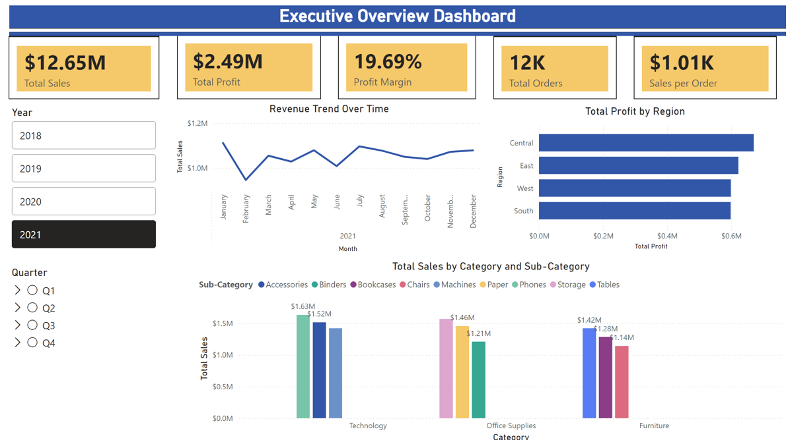
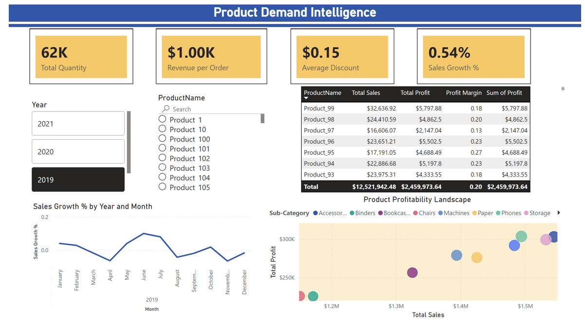
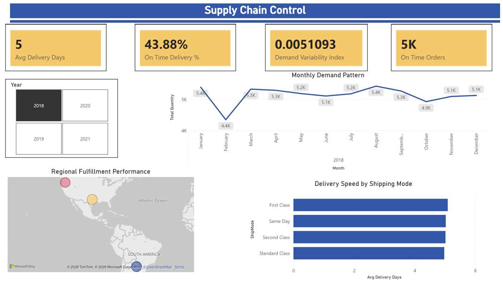

# Retail Sales Performance Dashboard

Interactive Power BI report analyzing four years of retail transactional data (2018–2021)
across sales, product demand, and supply chain operations.

🔗 **[View Live Interactive Dashboard](https://app.powerbi.com/groups/me/reports/74af21a2-c2cf-4c5c-b1e7-df8ee59f77aa/2078c7306b7bdcabff48?experience=power-bi)**

---

## Overview

This dashboard was built to give business stakeholders a complete picture of retail
performance — from top-level revenue and profit down to individual product profitability
and fulfillment efficiency. It is organized into three report pages, each answering a
distinct business question.

---

## Dashboard Pages

### 1. Executive Overview

The top-level summary for leadership. Key KPIs displayed at a glance:

- **$12.65M** Total Sales · **$2.49M** Total Profit · **19.69%** Profit Margin
- **12K** Total Orders · **$1.01K** Average Sales per Order

Includes a monthly revenue trend line (2018–2021), profit breakdown by region
(Central leads, followed by East, West, and South), and a grouped bar chart of
total sales by category and sub-category across Technology, Office Supplies,
and Furniture. Year and quarter slicers allow filtering the entire page dynamically.

---

### 2. Product Demand Intelligence

Focuses on product-level performance and demand trends. Key metrics:

- **62K** Total Quantity Sold · **$1.00K** Revenue per Order
- **$0.15** Average Discount · **0.54%** Sales Growth

Features a searchable product selector, a month-by-month sales growth line chart,
a ranked product profitability table (top performer: Product_99 at $5,797 profit),
and a bubble chart mapping each sub-category's total sales against total profit —
making it easy to spot which product lines deliver the best return.

---

### 3. Supply Chain Control

Tracks fulfillment and logistics performance. Key metrics:

- **5 days** Average Delivery Days · **43.88%** On-Time Delivery Rate
- **5K** On-Time Orders · **0.005** Demand Variability Index

Includes a monthly demand pattern chart showing order volume fluctuations
throughout the year (February dip to 4.4K is the most notable pattern),
a regional fulfillment map, and a delivery speed comparison by shipping mode
(First Class, Same Day, Second Class, Standard Class).

---

## Key Insights

- **Technology** is the highest-grossing category but **Office Supplies** shows
  competitive margins worth monitoring
- The **Central region** leads in total profit across all years
- **On-time delivery sits at 43.88%** — a clear operational improvement opportunity
- Demand dips sharply in **February** every year before recovering — relevant for
  inventory planning
- The product profitability bubble chart reveals several **high-sales, low-profit**
  sub-categories where pricing or cost structure should be reviewed

---

## Tools & Skills

- **Power BI Desktop** — data modeling, DAX measures, report design
- **DAX** — calculated columns and measures (profit margin %, sales growth %,
  demand variability index)
- **Data visualization** — KPI cards, line charts, bar charts, bubble charts,
  map visual, slicers
- **Data source:** Retail transactional dataset (2018–2021), 4 years of order-level records
